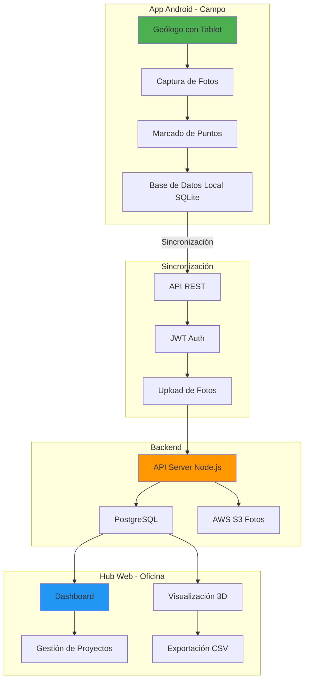
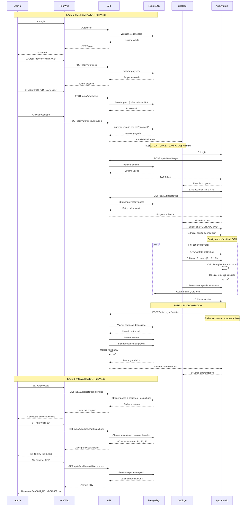
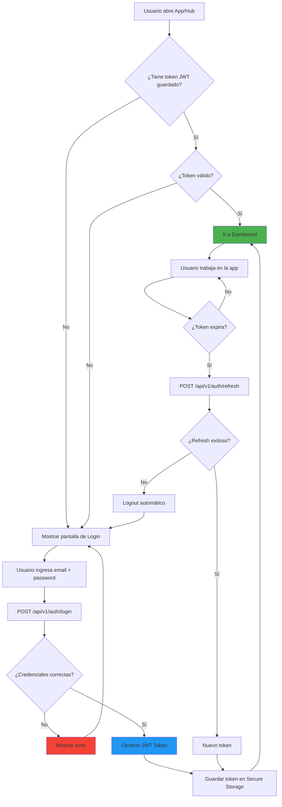
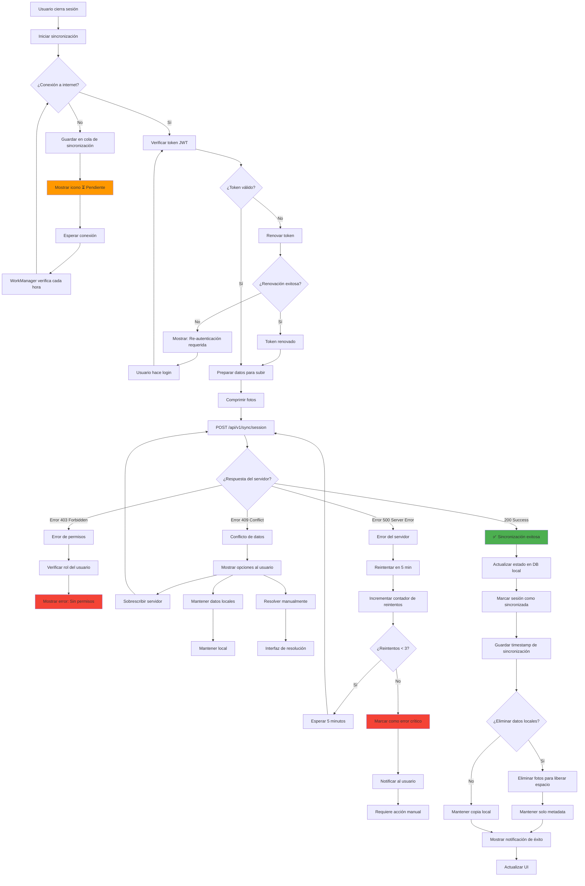
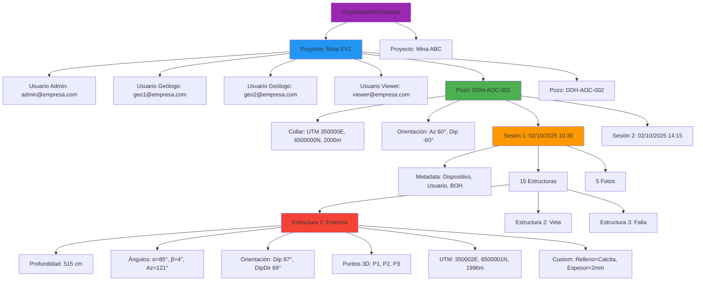
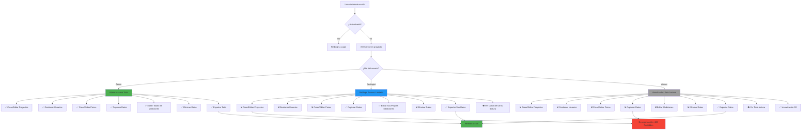
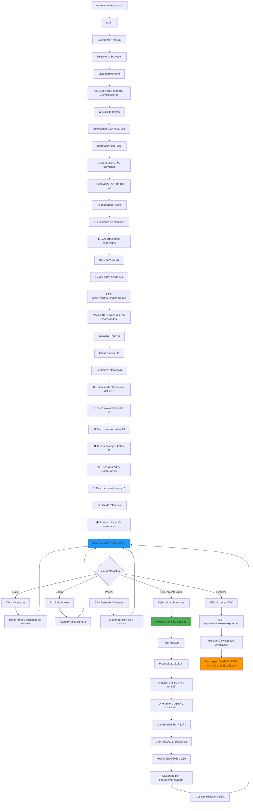
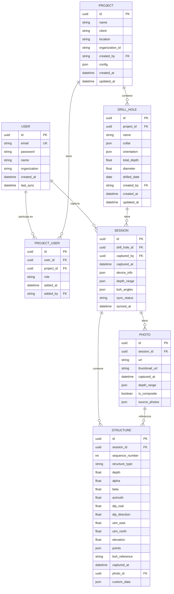
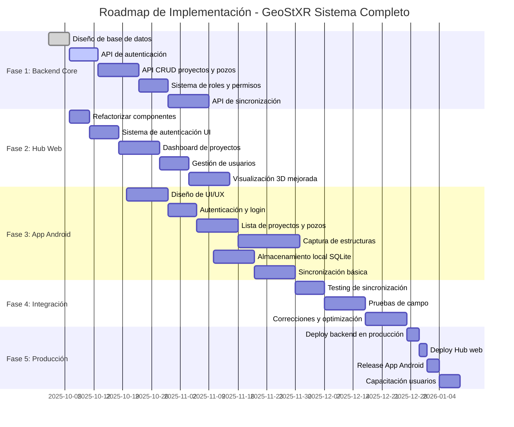

# Diagramas de Flujo - Sistema GeoStXR

## 📊 Diagramas Visuales del Sistema Completo

---

## 1. Arquitectura General del Sistema

---

## 2. Flujo Completo: Configuración → Captura → Visualización

---

## 3. Flujo de Login y Autenticación

---

## 4. Flujo de Captura de Estructura (App Android)

```mermaid
flowchart TD
    A[Geólogo en pozo] --> B[Abrir App]
    B --> C[Seleccionar Proyecto]
    C --> D[Seleccionar Pozo DDH-AOC-001]
    D --> E[Nueva Sesión de Medición]
    
    E --> F[Configurar Sesión]
    F --> F1[Ingresar Profundidad Manual ej: 515 cm]
    F1 --> F2[Configurar BOH1: 80.4°]
    F2 --> F3[Configurar BOH2: 97.9°]
    F3 --> G[Iniciar Captura]
    
    G --> H[Tomar Foto del Testigo]
    H --> I[Foto capturada]
    I --> J[Mostrar foto en pantalla]
    
    J --> K[Activar modo de marcado]
    K --> L[Geólogo marca P1 primer punto]
    L --> M[Geólogo marca P2 segundo punto]
    M --> N[Geólogo marca P3 tercer punto]
    
    N --> O[Calcular automáticamente]
    O --> O1[Alpha: ángulo del plano con eje del testigo]
    O1 --> O2[Beta: rotación alrededor del eje]
    O2 --> O3[Azimuth: orientación absoluta]
    O3 --> O4[Dip Real: buzamiento verdadero]
    O4 --> O5[Dip Direction: dirección del buzamiento]
    O5 --> O6[Coordenadas UTM de la estructura]
    
    O6 --> P[Mostrar resultados calculados]
    P --> Q{¿Valores correctos?}
    
    Q -->|No| K
    Q -->|Sí| R[Seleccionar Tipo de Estructura]
    
    R --> S[Menú de tipos]
    S --> S1[Fractura]
    S --> S2[Veta]
    S --> S3[Falla]
    S --> S4[Contacto]
    
    S1 --> T[Llenar columnas personalizadas]
    S2 --> T
    S3 --> T
    S4 --> T
    
    T --> T1[Relleno: Calcita]
    T1 --> T2[Espesor: 2mm]
    T2 --> T3[Dureza opcional]
    
    T3 --> U[Guardar Estructura]
    U --> V[Almacenar en SQLite local]
    V --> W{¿Más estructuras?}
    
    W -->|Sí| G
    W -->|No| X[Cerrar Sesión]
    
    X --> Y[Generar Reporte CSV local]
    Y --> Z{¿Hay internet?}
    
    Z -->|Sí| AA[Sincronizar automáticamente]
    Z -->|No| AB[Marcar como pendiente]
    
    AA --> AC[Subir datos al servidor]
    AC --> AD[✅ Sincronización exitosa]
    
    AB --> AE[⏳ Sincronización pendiente]
    AE --> AF[Sincronizar cuando haya conexión]
    
    style AD fill:#4CAF50
    style AE fill:#FF9800
    style O fill:#2196F3
```

---

## 5. Flujo de Sincronización con Manejo de Errores

---

## 6. Jerarquía de Datos y Relaciones

---

## 7. Sistema de Roles y Permisos

---

## 8. Flujo de Visualización 3D en Hub

---

## 9. Arquitectura de Base de Datos

---

## 10. Timeline de Implementación

---

Estos diagramas están en formato **Mermaid** y se renderizarán automáticamente en:
- ✅ GitHub
- ✅ GitLab  
- ✅ Visual Studio Code (con extensión)
- ✅ Notion
- ✅ Confluence

¿Quieres que cree más diagramas específicos o mockups de las interfaces? 🎨

