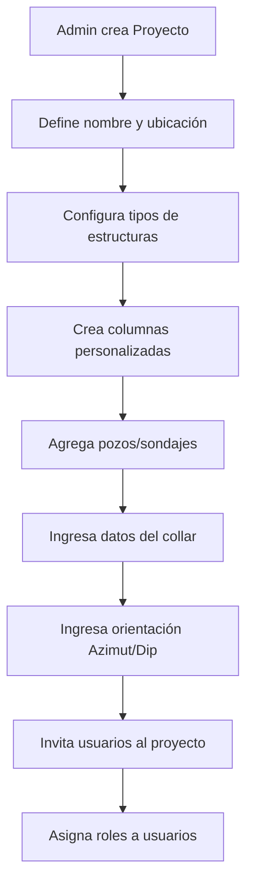
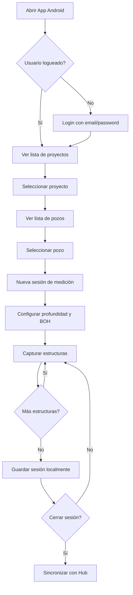
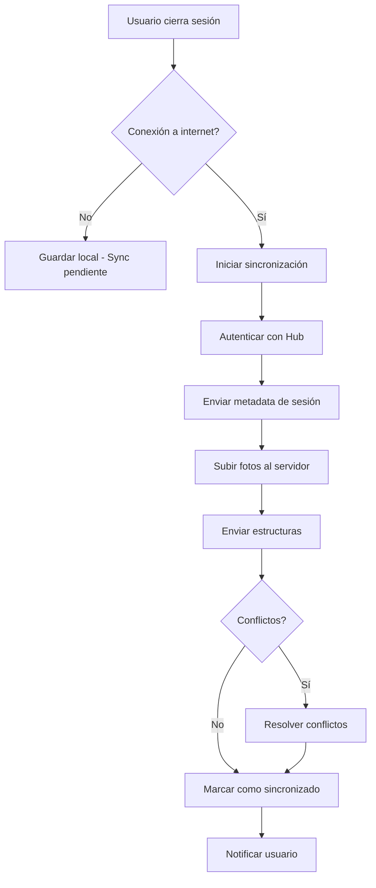
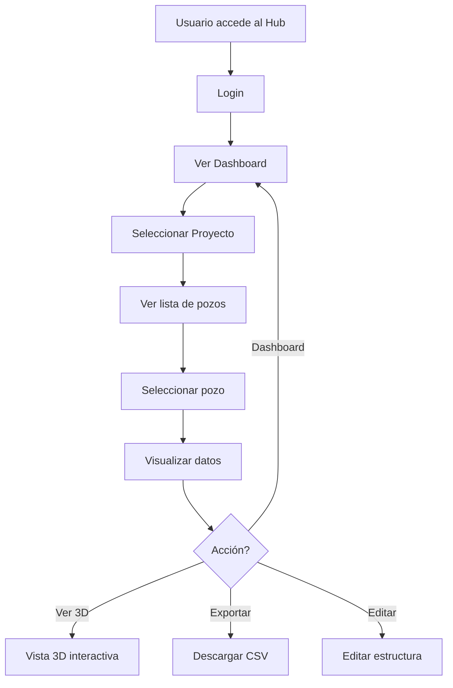

# Arquitectura del Sistema GeoStXR
## Flujo de Captura de Datos y Sincronización Android ↔️ Hub

---

## 📋 Tabla de Contenidos

1. [Estructura de Datos](#estructura-de-datos)
2. [Roles y Permisos](#roles-y-permisos)
3. [Flujo de Trabajo](#flujo-de-trabajo)
4. [API Endpoints](#api-endpoints)
5. [Sincronización](#sincronización)
6. [Seguridad](#seguridad)

---

## 🗂️ Estructura de Datos

### Jerarquía del Sistema

```
Organización/Empresa
  └── Proyectos
       ├── Usuarios (con roles)
       ├── Pozos/Sondajes (DDH)
       │    ├── Información del Collar
       │    ├── Orientación (Azimut, Dip)
       │    └── Sesiones de Medición
       │         ├── Metadata (fecha, usuario, dispositivo)
       │         ├── Configuración (BOH, profundidad)
       │         └── Estructuras Capturadas
       │              ├── Tipo de estructura
       │              ├── Ángulos (Alpha, Beta, Azimuth)
       │              ├── Orientación (Dip, Dip Direction)
       │              ├── Puntos 3D (P1, P2, P3)
       │              ├── Fotos
       │              └── Columnas Personalizadas
       └── Configuración
            ├── Tipos de Estructuras
            └── Columnas Personalizadas
```

### Modelo de Datos

```typescript
// Usuario
interface User {
  id: string
  email: string
  name: string
  organization: string
  createdAt: Date
  lastSync?: Date
}

// Proyecto
interface Project {
  id: string
  name: string
  client?: string
  location?: string
  organizationId: string
  createdBy: string
  createdAt: Date
  updatedAt: Date
  
  // Configuración del proyecto
  config: {
    structureTypes: string[]  // ["Fractura", "Veta", "Falla", etc.]
    customColumns: CustomColumn[]
    defaultBOH?: { boh1: number, boh2: number }
  }
  
  // Control de acceso
  users: ProjectUser[]
  drillHoles: DrillHole[]
}

// Usuario en Proyecto (con rol)
interface ProjectUser {
  userId: string
  role: 'admin' | 'geologist' | 'viewer'
  addedAt: Date
  addedBy: string
}

// Pozo/Sondaje
interface DrillHole {
  id: string
  projectId: string
  name: string  // Ej: "DDH-AOC-001"
  
  // Información del collar
  collar: {
    utmEast: number
    utmNorth: number
    elevation: number
    zone?: string
  }
  
  // Orientación
  orientation: {
    azimuth: number  // 0-360°
    dip: number      // -90 a 0°
  }
  
  // Metadata
  totalDepth: number  // metros
  diameter?: number   // mm
  drilledDate?: Date
  
  createdBy: string
  createdAt: Date
  updatedAt: Date
  
  // Sesiones de medición
  sessions: MeasurementSession[]
}

// Sesión de Medición (captura en campo)
interface MeasurementSession {
  id: string
  drillHoleId: string
  
  // Metadata de la sesión
  capturedBy: string  // userId
  capturedAt: Date
  deviceInfo: {
    model: string
    osVersion: string
    appVersion: string
  }
  
  // Configuración de la medición
  depthRange: {
    start: number  // cm
    end: number    // cm
  }
  bohAngles: {
    boh1: number
    boh2: number
  }
  
  // Datos capturados
  structures: Structure[]
  photos?: Photo[]
  
  // Estado de sincronización
  syncStatus: 'pending' | 'synced' | 'conflict'
  syncedAt?: Date
}

// Estructura medida
interface Structure {
  id: string
  sessionId: string
  sequenceNumber: number  // Orden de captura
  
  // Tipo
  structureType: string
  
  // Posición
  depth: number  // cm desde collar
  
  // Ángulos locales (cilindro)
  alpha: number
  beta: number
  azimuth: number
  
  // Orientación geoespacial
  dipReal: number
  dipDirection: number
  
  // Posición geoespacial
  utmEast: number
  utmNorth: number
  elevation: number
  
  // Geometría 3D capturada
  points: {
    p1: { x: number, y: number, z: number }
    p2: { x: number, y: number, z: number }
    p3: { x: number, y: number, z: number }
  }
  
  // Referencias
  bohReference: 'BOH1' | 'BOH2'
  
  // Metadata
  capturedAt: Date
  photoId?: string
  
  // Datos personalizados
  customData?: Record<string, any>
}

// Foto de la medición
interface Photo {
  id: string
  sessionId: string
  structureIds: string[]  // Estructuras visibles en esta foto
  
  // Imagen
  url: string
  thumbnailUrl?: string
  
  // Metadata
  capturedAt: Date
  depthRange: { start: number, end: number }
  
  // Composición (si aplica)
  isComposite: boolean
  sourcePhotos?: string[]  // IDs de fotos originales
}
```

---

## 👥 Roles y Permisos

### Roles del Sistema

#### 1. **Administrador de Proyecto** (`admin`)
**Permisos:**
- ✅ Gestionar usuarios del proyecto (agregar, quitar, cambiar roles)
- ✅ Crear, editar y eliminar pozos
- ✅ Configurar tipos de estructuras y columnas personalizadas
- ✅ Ver todos los datos del proyecto
- ✅ Exportar datos
- ✅ Eliminar sesiones y estructuras
- ✅ Capturar datos en campo

#### 2. **Geólogo de Campo** (`geologist`)
**Permisos:**
- ✅ Ver información de pozos
- ✅ Capturar datos en campo (sesiones de medición)
- ✅ Editar sus propias mediciones
- ✅ Exportar sus propios datos
- ✅ Ver datos de otros geólogos (solo lectura)
- ❌ No puede eliminar pozos
- ❌ No puede gestionar usuarios

#### 3. **Visualizador** (`viewer`)
**Permisos:**
- ✅ Ver información de pozos
- ✅ Ver estructuras capturadas (solo lectura)
- ✅ Ver visualizaciones 3D
- ✅ Exportar datos
- ❌ No puede capturar datos
- ❌ No puede editar nada
- ❌ No puede eliminar nada

### Matriz de Permisos

| Acción | Admin | Geologist | Viewer |
|--------|-------|-----------|--------|
| Crear proyecto | ✅ | ❌ | ❌ |
| Editar proyecto | ✅ | ❌ | ❌ |
| Gestionar usuarios | ✅ | ❌ | ❌ |
| Crear pozo | ✅ | ❌ | ❌ |
| Editar pozo | ✅ | ❌ | ❌ |
| Ver pozos | ✅ | ✅ | ✅ |
| Capturar mediciones | ✅ | ✅ | ❌ |
| Editar propias mediciones | ✅ | ✅ | ❌ |
| Editar mediciones de otros | ✅ | ❌ | ❌ |
| Eliminar mediciones | ✅ | ❌ | ❌ |
| Ver datos | ✅ | ✅ | ✅ |
| Exportar datos | ✅ | ✅ | ✅ |
| Ver visualización 3D | ✅ | ✅ | ✅ |

---

## 🔄 Flujo de Trabajo

### Fase 1: Configuración Inicial (Hub Web)



**Pasos detallados:**

1. **Crear Proyecto** (Admin)
   - Nombre del proyecto
   - Cliente
   - Ubicación
   - Fecha de inicio

2. **Configurar Proyecto** (Admin)
   - Tipos de estructuras: Fractura, Veta, Falla, Contacto, etc.
   - Columnas personalizadas: Relleno, Espesor, Dureza, etc.
   - BOH por defecto (opcional)

3. **Crear Pozos** (Admin)
   - Nombre: DDH-AOC-001
   - Coordenadas UTM del collar
   - Elevación
   - Azimut y Dip
   - Profundidad total (si se conoce)

4. **Invitar Usuarios** (Admin)
   - Email del usuario
   - Rol en el proyecto
   - Notificación por email

### Fase 2: Captura en Campo (App Android)



**Pasos detallados:**

1. **Login**
   ```
   Email: geologo@empresa.com
   Password: ********
   ```

2. **Seleccionar Proyecto**
   - Lista de proyectos donde el usuario tiene acceso
   - Mostrar rol del usuario

3. **Seleccionar Pozo**
   - Lista de pozos del proyecto
   - Mostrar info básica: nombre, profundidad, última medición

4. **Iniciar Sesión de Medición**
   - Profundidad manual (cm)
   - Configurar BOH1 y BOH2
   - Verificar cámara

5. **Capturar Estructuras** (Loop)
   - Tomar foto del testigo
   - Marcar 3 puntos en el plano estructural
   - Sistema calcula automáticamente:
     - Alpha, Beta, Azimuth
     - Dip Real, Dip Direction
     - Coordenadas P1, P2, P3
     - Posición geoespacial
   - Seleccionar tipo de estructura
   - Llenar columnas personalizadas (opcional)
   - Guardar estructura

6. **Finalizar Sesión**
   - Revisar estructuras capturadas
   - Generar reporte CSV local
   - Marcar sesión como "pendiente de sincronización"

### Fase 3: Sincronización (Android → Hub)



**Detalles de Sincronización:**

1. **Trigger de Sincronización**
   - Automático al cerrar sesión (si hay internet)
   - Manual desde el menú de la app
   - Automático en background (si está configurado)

2. **Proceso de Subida**
   ```
   POST /api/v1/sync/session
   
   Headers:
     Authorization: Bearer {jwt_token}
   
   Body:
   {
     "sessionId": "session-uuid",
     "drillHoleId": "ddh-uuid",
     "projectId": "project-uuid",
     "capturedAt": "2025-10-02T10:30:00Z",
     "deviceInfo": {
       "model": "Samsung Galaxy S21",
       "osVersion": "Android 13",
       "appVersion": "1.2.0"
     },
     "depthRange": { "start": 500, "end": 530 },
     "bohAngles": { "boh1": 80.4, "boh2": 97.9 },
     "structures": [
       {
         "id": "struct-uuid",
         "structureType": "Fractura",
         "depth": 515.0,
         "alpha": 85.48,
         "beta": 4.21,
         "azimuth": 120.81,
         "dipReal": 87.17,
         "dipDirection": 68.90,
         "points": {
           "p1": { "x": -2.6836, "y": 1.6822, "z": 14.6413 },
           "p2": { "x": -0.5745, "y": 3.1184, "z": 14.8241 },
           "p3": { "x": 2.3582, "y": 2.1072, "z": 14.8742 }
         },
         "utmEast": 350002.17,
         "utmNorth": 6500001.25,
         "elevation": 1995.67,
         "bohReference": "BOH2",
         "capturedAt": "2025-10-02T10:35:22Z",
         "customData": {
           "relleno": "Calcita",
           "espesor": "2mm"
         }
       }
     ],
     "photos": [
       {
         "id": "photo-uuid",
         "base64": "data:image/jpeg;base64,...",
         "depthRange": { "start": 500, "end": 530 },
         "capturedAt": "2025-10-02T10:35:00Z"
       }
     ]
   }
   ```

3. **Respuesta del Servidor**
   ```json
   {
     "success": true,
     "sessionId": "session-uuid",
     "syncedAt": "2025-10-02T10:36:00Z",
     "structuresSynced": 15,
     "photosSynced": 5
   }
   ```

4. **Manejo de Errores**
   - Sin conexión: Reintenta automáticamente
   - Token expirado: Re-autenticar
   - Conflicto de datos: Mostrar al usuario para resolver

### Fase 4: Visualización y Análisis (Hub Web)



---

## 🔌 API Endpoints

### Autenticación

```
POST   /api/v1/auth/login
POST   /api/v1/auth/logout
POST   /api/v1/auth/refresh
GET    /api/v1/auth/me
```

### Proyectos

```
GET    /api/v1/projects              # Lista proyectos del usuario
POST   /api/v1/projects              # Crear proyecto (admin)
GET    /api/v1/projects/:id          # Detalles del proyecto
PUT    /api/v1/projects/:id          # Actualizar proyecto (admin)
DELETE /api/v1/projects/:id          # Eliminar proyecto (admin)

# Usuarios del proyecto
GET    /api/v1/projects/:id/users              # Lista usuarios
POST   /api/v1/projects/:id/users              # Agregar usuario (admin)
PUT    /api/v1/projects/:id/users/:userId      # Cambiar rol (admin)
DELETE /api/v1/projects/:id/users/:userId      # Quitar usuario (admin)

# Configuración
GET    /api/v1/projects/:id/config              # Obtener configuración
PUT    /api/v1/projects/:id/config              # Actualizar configuración (admin)
```

### Pozos/Sondajes

```
GET    /api/v1/projects/:id/drillholes          # Lista pozos
POST   /api/v1/projects/:id/drillholes          # Crear pozo (admin)
GET    /api/v1/drillholes/:id                   # Detalles del pozo
PUT    /api/v1/drillholes/:id                   # Actualizar pozo (admin)
DELETE /api/v1/drillholes/:id                   # Eliminar pozo (admin)
```

### Sesiones de Medición

```
GET    /api/v1/drillholes/:id/sessions          # Lista sesiones
POST   /api/v1/drillholes/:id/sessions          # Crear sesión (geologist+)
GET    /api/v1/sessions/:id                     # Detalles de sesión
PUT    /api/v1/sessions/:id                     # Actualizar sesión (owner o admin)
DELETE /api/v1/sessions/:id                     # Eliminar sesión (admin)
```

### Estructuras

```
GET    /api/v1/sessions/:id/structures          # Lista estructuras
POST   /api/v1/sessions/:id/structures          # Agregar estructura
GET    /api/v1/structures/:id                   # Detalle de estructura
PUT    /api/v1/structures/:id                   # Actualizar estructura (owner o admin)
DELETE /api/v1/structures/:id                   # Eliminar estructura (admin)
```

### Sincronización

```
POST   /api/v1/sync/session                     # Sincronizar sesión completa
POST   /api/v1/sync/check                       # Verificar cambios pendientes
GET    /api/v1/sync/status                      # Estado de sincronización
```

### Exportación

```
GET    /api/v1/drillholes/:id/export/csv        # Exportar CSV
GET    /api/v1/projects/:id/export/csv          # Exportar proyecto completo
GET    /api/v1/sessions/:id/export/csv          # Exportar sesión
```

---

## 🔄 Sincronización Detallada

### Estrategia de Sincronización

**Modelo: Optimistic Offline Lock**

1. **Datos locales primero**: La app funciona completamente offline
2. **Sincronización en background**: Cuando hay conexión
3. **Resolución de conflictos**: Última escritura gana (LWW - Last Write Wins)

### Escenarios

#### Escenario 1: Sincronización Normal
```
1. Geólogo captura datos en campo (offline)
2. Datos se guardan localmente en SQLite
3. Al finalizar sesión, intenta sincronizar
4. Si hay internet: subir al servidor
5. Servidor valida y almacena
6. Respuesta exitosa → marcar como sincronizado
7. App puede eliminar datos locales sincronizados (opcional)
```

#### Escenario 2: Sin Conexión
```
1. Geólogo captura datos en campo (offline)
2. Datos se guardan localmente
3. Al finalizar sesión, no hay internet
4. Marcar sesión como "pendiente de sincronización"
5. Mostrar indicador visual en la app
6. Cuando hay internet: sincronizar automáticamente en background
7. Notificar al usuario cuando se sincronice
```

#### Escenario 3: Conflicto de Datos
```
1. Geólogo A y B editan la misma estructura
2. Geólogo A sincroniza primero
3. Geólogo B intenta sincronizar después
4. Servidor detecta conflicto (timestamp diferente)
5. Opciones:
   a) LWW: Aceptar cambios de B (sobrescribir A)
   b) Merge: Combinar ambos cambios
   c) Manual: Pedir al usuario resolver
```

### Estado de Sincronización

**En la App:**
```typescript
interface SyncStatus {
  lastSync: Date | null
  pendingSessions: number
  pendingStructures: number
  pendingPhotos: number
  syncInProgress: boolean
  errors: SyncError[]
}

interface SyncError {
  sessionId: string
  error: string
  timestamp: Date
  retryCount: number
}
```

**Indicadores visuales:**
- 🟢 Sincronizado
- 🟡 Sincronización pendiente
- 🔴 Error de sincronización
- 🔵 Sincronizando...

---

## 🔒 Seguridad

### Autenticación

**JWT (JSON Web Tokens)**

```typescript
interface JWTPayload {
  userId: string
  email: string
  organizationId: string
  iat: number  // issued at
  exp: number  // expiration (24h)
}
```

**Flujo:**
1. Usuario se loguea → Servidor genera JWT
2. App almacena JWT en secure storage
3. Cada request incluye: `Authorization: Bearer {jwt}`
4. Servidor valida JWT en cada request
5. Si JWT expira → Auto-refresh o re-login

### Autorización

**Middleware de permisos:**

```typescript
// Ejemplo de middleware Express
function requireRole(roles: string[]) {
  return async (req, res, next) => {
    const projectId = req.params.projectId
    const userId = req.user.id
    
    // Obtener rol del usuario en el proyecto
    const projectUser = await getProjectUser(projectId, userId)
    
    if (!projectUser || !roles.includes(projectUser.role)) {
      return res.status(403).json({ error: 'Forbidden' })
    }
    
    next()
  }
}

// Uso
app.post('/api/v1/projects/:id/drillholes', 
  requireRole(['admin']), 
  createDrillHole
)
```

### Encriptación

1. **En tránsito**: HTTPS/TLS para todas las comunicaciones
2. **En reposo**: 
   - Passwords: bcrypt hash
   - Datos sensibles: AES-256
3. **En dispositivo**: 
   - SQLite con SQLCipher
   - Secure Storage para tokens

---

## 📱 Consideraciones de Implementación

### App Android

**Stack Tecnológico Recomendado:**
- Kotlin
- Jetpack Compose (UI)
- Room (Base de datos local)
- Retrofit (API calls)
- WorkManager (Sincronización en background)
- CameraX (Captura de fotos)
- Hilt (Dependency Injection)

**Arquitectura:**
- MVVM (Model-View-ViewModel)
- Repository Pattern
- Clean Architecture

### Hub Web

**Stack Tecnológico Actual:**
- Next.js 14 (React)
- TypeScript
- Three.js (Visualización 3D)
- Tailwind CSS

**Backend Recomendado:**
- Node.js + Express (o Fastify)
- PostgreSQL (Base de datos principal)
- Redis (Cache y sesiones)
- AWS S3 (Almacenamiento de fotos)
- JWT para autenticación

---

## 🚀 Roadmap de Implementación

### Fase 1: Core (2-3 meses)
- [ ] Sistema de autenticación
- [ ] CRUD de proyectos y pozos
- [ ] Sistema de roles básico
- [ ] API REST completa
- [ ] Base de datos PostgreSQL

### Fase 2: App Android (3-4 meses)
- [ ] Login y autenticación
- [ ] Lista de proyectos/pozos
- [ ] Captura de estructuras
- [ ] Almacenamiento local
- [ ] Sincronización básica

### Fase 3: Hub Web (2-3 meses)
- [ ] Dashboard de proyectos
- [ ] Gestión de usuarios y permisos
- [ ] Importación de datos sincronizados
- [ ] Visualización 3D mejorada
- [ ] Exportación de datos

### Fase 4: Avanzado (2-3 meses)
- [ ] Sincronización en background
- [ ] Resolución de conflictos
- [ ] Notificaciones push
- [ ] Analytics y reportes
- [ ] Backup automático

---

## 📝 Notas Finales

- **Escalabilidad**: Diseñado para manejar múltiples proyectos y usuarios
- **Offline-first**: La app funciona sin internet
- **Seguridad**: Autenticación robusta y control de acceso granular
- **Flexibilidad**: Configuración personalizable por proyecto
- **Auditoría**: Todos los cambios son rastreables (quién, cuándo, qué)

